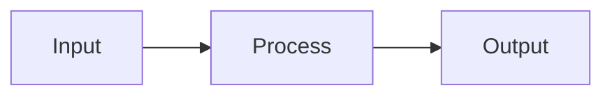

# md-pdf

CLI tool that converts Markdown into professionally branded PDFs with title pages, table of contents, Mermaid diagrams, syntax highlighting, and slide layouts.

## Example output

Download generated PDFs from the [latest release](https://github.com/Moravio/homebrew-md-pdf/releases/latest):

| Example | Layout | Features |
|---------|--------|----------|
| [sample-document.pdf](https://github.com/Moravio/homebrew-md-pdf/releases/latest/download/sample-document.pdf) | Document | Title page, TOC, Mermaid diagrams, code blocks, tables |
| [sample-slides.pdf](https://github.com/Moravio/homebrew-md-pdf/releases/latest/download/sample-slides.pdf) | Slides | Slide layout with auto page breaks |
| [priklad-dokument.pdf](https://github.com/Moravio/homebrew-md-pdf/releases/latest/download/priklad-dokument.pdf) | Document | Czech language, localized labels |
| [priklad-prezentace.pdf](https://github.com/Moravio/homebrew-md-pdf/releases/latest/download/priklad-prezentace.pdf) | Slides | Czech slides |
| [sample-document-duckbyte.pdf](https://github.com/Moravio/homebrew-md-pdf/releases/latest/download/sample-document-duckbyte.pdf) | Document | Custom built-in branding (Duckbyte) |
| [sample-external-branding.pdf](https://github.com/Moravio/homebrew-md-pdf/releases/latest/download/sample-external-branding.pdf) | Document | External branding folder |
| [toc-multipage-test.pdf](https://github.com/Moravio/homebrew-md-pdf/releases/latest/download/toc-multipage-test.pdf) | Document | Multi-page table of contents |
| [toc-emoji-test.pdf](https://github.com/Moravio/homebrew-md-pdf/releases/latest/download/toc-emoji-test.pdf) | Document | Emoji in headings and TOC |

## Features

- **Two layouts** — `document` (report style with TOC and page numbers) and `slides` (presentation style with auto page breaks)
- **Title page** — auto-generated from metadata (title, subtitle, author, client, date, custom fields)
- **Table of contents** — auto-generated with clickable links and page numbers
- **Mermaid diagrams** — rendered inline (flowcharts, sequence diagrams, etc.)
- **Syntax highlighting** — code blocks with language-aware highlighting
- **Branding** — built-in themes or custom branding folders (logo, colors, fonts)
- **Bilingual** — English and Czech with localized labels and date formats
- **Live reload** — `--watch` flag regenerates on file changes
- **Quick preview** — `--open` flag opens the PDF after generation

## Installation

```bash
brew tap moravio/md-pdf
brew install md-pdf
```

Requires a Chromium-based browser for PDF rendering:

```bash
brew install --cask google-chrome
```

## Quick start

### 1. Create your document

**report.md**
```markdown
# Introduction

This is a sample document with **bold**, *italic*, and `code`.

## Data flow



## Code example

```javascript
function greet(name) {
  return `Hello, ${name}!`;
}
```
```

**report.meta.json**
```json
{
  "title": "Project Report",
  "subtitle": "Q1 2026",
  "author": "Jane Doe",
  "layout": "document",
  "language": "en"
}
```

### 2. Generate the PDF

```bash
md-pdf report.md --open
```

The PDF is written to the current directory and opened automatically.

## CLI reference

```
Usage: md-pdf <input.md> [output.pdf]

Options:
  -h, --help     Show help with full .meta.json field reference
  -v, --version  Show version
  --open         Open the PDF after generation
  --watch        Watch for changes and regenerate automatically
```

### Metadata fields (.meta.json)

| Field | Required | Description |
|-------|----------|-------------|
| `title` | Yes | Document title (shown on title page) |
| `layout` | Yes | `"document"` or `"slides"` |
| `language` | Yes | `"en"` or `"cs"` |
| `subtitle` | No | Subtitle text |
| `author` | No | Author name |
| `client` | No | Client or organization |
| `email` | No | Contact email |
| `phoneNumber` | No | Contact phone |
| `date` | No | Explicit date (default: today) |
| `customFields` | No | Object of label-value pairs for the title page |
| `pagination` | No | `true`/`false` (default: `true`) — page numbers |
| `toc` | No | `true`/`false` (default: `true`) — table of contents |
| `branding` | No | Built-in branding id (default: `"moravio-default"`) |
| `brandingDir` | No | Path to external branding folder |

### Missing .meta.json

If the metadata file is missing, `md-pdf` will offer to create a template:

```
$ md-pdf report.md
Error: Metadata file not found: /path/to/report.meta.json

Create a template .meta.json? [Y/n]
```

## Custom branding

Create your own branding with custom logo, colors, and fonts:

```bash
# Scaffold a branding folder
md-pdf-branding-init ./my-brand

# Edit the files:
#   my-brand/branding.json   — colors, fonts, margins
#   my-brand/logo.svg        — header logo
#   my-brand/decoration.svg  — title page decoration
#   my-brand/footer-mark.svg — footer icon

# Validate
md-pdf-branding-check ./my-brand

# Use it
# In your .meta.json: "brandingDir": "./my-brand"
```

## Updating

```bash
brew update
brew upgrade md-pdf
```
