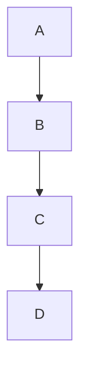
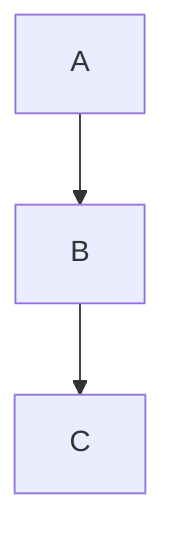

# Authoring Markdown for @moravio/md-pdf

This guide explains how to write `.md` files so the `md-pdf` pipeline turns them into PDFs in **document** or **slides** layout. To install the tool in another codebase: see **[consuming-in-other-projects.md](consuming-in-other-projects.md)**.

## Tool versions (what to expect)

| Component               | Version / source                              | Notes                                                                                      |
| ----------------------- | --------------------------------------------- | ------------------------------------------------------------------------------------------ |
| **Mermaid** (prerender) | **11.x** from the direct `mermaid` dependency | Defined in `prerender-mermaid.js`. Prefer syntax you verify against the installed version. |
| **Markdown → HTML**     | **marked 9.x**                                | GFM tables, fenced code, and most classic syntax work out of the box.                      |
| **Code highlighting**   | **highlight.js 11.x**                         | Unknown languages render as plain text.                                                    |
| **PDF from HTML**       | **Puppeteer 24.x**                            | Requires local Chromium / Chrome.                                                          |

Official diagram reference: [Mermaid documentation](https://mermaid.js.org/).

## Required files

- **`document.md`** — body content.
- **`document.meta.json`** — title-page metadata (same basename as `.md`). **Optional** — without it, md-pdf generates a simple PDF (no title page, TOC, or pagination). See **Simple mode** below.

## Metadata (`.meta.json`)

With an explicit title-page date:

```json
{
  "title": "Title",
  "subtitle": "Subtitle",
  "date": "27 March 2026",
  "author": "Name",
  "email": "you@example.com",
  "phoneNumber": "+420 …",
  "client": "Client",
  "customFields": {
    "Field label": "Value"
  },
  "layout": "document",
  "language": "en"
}
```

Minimal **document** metadata (no email, phone, or extra lines under the client):

```json
{
  "title": "Title",
  "subtitle": "Subtitle",
  "author": "Name",
  "client": "Client",
  "layout": "document",
  "language": "en"
}
```

**`date` is optional.** You can omit the `date` key entirely or set `"date": ""`. In both cases the pipeline uses **today’s date** on the title page, formatted according to **`language`** (`en` → long English date, `cs` → e.g. `27. března 2026`).

- **`email`**: optional. When set, it appears on the author line as a `mailto:` link. When omitted or empty, no email segment is shown (no stray `/`).
- **`phoneNumber`**: optional. When set, it appears after the author name and optional email, separated by **`/`**, as a `tel:` link. Omitted segments are skipped so you never get empty slashes.
- **`customFields`**: optional object whose **keys** are label text and **values** are plain text. Entries are rendered **below the client** on the title page, one per line, using the same label styling as **Client** (document) or stacked blocks (slides). Keys should be strings; values are stringified. Empty keys or values are skipped. If `customFields` is not a plain object (e.g. an array), it is ignored and a warning is printed. In **`document`** layout, date/author/client/custom rows share a **two-column grid**: the label column is at least the **`width`** set in **`titlePage.document.labelStyle`** in **`branding.json`** (often 80px) and **expands** if a label (including a long **`customFields`** key) needs more room, so values stay aligned and do not overlap the label.

- **`layout`**: omit or `"document"` for a standard report; `"slides"` for a slide deck (different title page, A4 landscape, different PDF merge path).
- **`language`**: `"en"` (default) or `"cs"`. Controls the **default date** format (when **`date`** is omitted or empty), **title-page labels** (Date, Author, Client, Presentation, …), and the **table of contents** heading (`Contents` vs `Obsah`).
- **`pagination`**: optional boolean, default **`true`**. Set **`false`** to turn off **automatic** slide breaks in **`slides`** layout (content flows like a continuous document; manual `<div class="page-break"></div>` still works). In **`slides`** layout with **`false`**, the merged PDF has **no footer** (no **“n / total”** page strip or eagle logo). With **`false`**, the content PDF uses a **slightly smaller bottom margin** so the body can extend a bit lower. **`document`** layout keeps the usual footer; only the bottom-margin tweak applies when **`pagination`** is **`false`**.
- **`titlePage`**: optional boolean, default **`true`**. Set **`false`** to **skip the title page entirely**. The PDF starts directly with the content. Branding CSS, TOC, and page numbering still work — page numbers start from 1 on the first content page. Useful for short documents, appendices, or when the title is included directly in the Markdown.
- **`toc`**: optional boolean, default **`true`**. Set **`false`** in **`document`** layout to **skip the generated table of contents** — the PDF is **title page + body** only (no TOC pages or measurement pass). Ignored for **`slides`**. Page footers (**`n / total`** + eagle) behave like the normal document merge.
- **`branding`**: optional string id, default **`moravio-default`**. Must match a folder `brandings/<id>/` **inside the installed package** with **`branding.json`** plus assets. Ignored when **`brandingDir`** is set. See **Branding** below.
- **`brandingDir`**: optional string path to a **folder** that contains **`branding.json`** (and the SVG assets listed there). Resolved relative to the **directory of your `.meta.json`** file (not the shell’s current working directory). Absolute paths are allowed. When present, **`branding`** is ignored — use this from **another repository** so your brand is **not** stored under **`node_modules`**. See **External branding (consumer projects)** below.

## Branding

### Built-in brands (package)

Brands shipped with the tool live under **`brandings/<id>/`** at the **package root** (the same directory that contains `convert-to-pdf.js`). The **`branding`** value in `.meta.json` is the folder name **`<id>`**; the loader opens `brandings/<id>/branding.json`. Keep **`"id"`** inside `branding.json` equal to that folder name so paths and errors stay clear.

### External branding (consumer projects)

Use this when you depend on **`@moravio/md-pdf`** from Git in **your own repo** and want a brand that survives **`npm install`** without forking.

1. **Scaffold** a copy of **`moravio-default`** next to your docs (from your project root, with the package installed):

   ```bash
   npx md-pdf-branding-init ./docs/brand/my-company
   ```

   Or run **`md-pdf-branding-init`** via an npm script so `node_modules/.bin` is on `PATH`.

2. **Edit** **`branding.json`**, **`logo.svg`**, **`decoration.svg`**, **`footer-mark.svg`**. The init template now copies **`fonts/InterVariable.ttf`** and **`fonts/inter-variable.css`** into the new brand so the default scaffold renders offline. If you switch to another family, update **`fonts.fontCssDocument`** / **`fonts.fontCssSlides`** and adjust **`toc.fontRegular`** / **`fontBold`** accordingly. The older **`googleImport…`** keys still work as a deprecated fallback, but **`md-pdf-branding-check`** warns when they are the active source.

3. **Validate** before building PDFs:

   ```bash
   npx md-pdf-branding-check ./docs/brand/my-company
   ```

   This checks JSON + assets and runs the same **CSS vars / title-page / resolved runtime** steps as a real conversion (without Chromium).

4. In **`.meta.json`**, point at the folder **relative to the meta file**:

   ```json
   "brandingDir": "../brand/my-company"
   ```

   If **`sample.md`** and **`sample.meta.json`** sit in **`docs/`** and the brand is **`docs/brand/my-company`**, use **`"brandingDir": "brand/my-company"`**.

**CLI binaries** (after install): **`md-pdf-branding-init`**, **`md-pdf-branding-check`**. Example in this repo: **`examples/consumer-brand/`**.

### Quick start (new brand)

1. Copy **`brandings/moravio-default/`** to **`brandings/<your-id>/`** (or copy **`duckbyte-advisory`** if you want a second real-world example).
2. In **`branding.json`**, set **`"id"`** to **`"<your-id>"`** (same as the folder).
3. Replace **`logo.svg`**, **`decoration.svg`**, and **`footer-mark.svg`** (or keep filenames and point **`assets`** at your names).
4. Adjust **`fonts`** (stacks + local **`fontCssDocument`** / **`fontCssSlides`**; avoid the deprecated **`googleImport…`** fallback) and **`contentCss`** colors to match the brand.
5. Tune **`titlePage.document`** and **`titlePage.slides`** inline styles (especially **`decorationImgStyle`** and **`logoImgStyle`**) so the title page matches your artwork.
6. In **`.meta.json`**, set **`"branding": "<your-id>"`** and run a test PDF.

Validation is strict: **`version`** must be **`1`**, **`assets.logo`**, **`assets.decoration`**, and **`assets.footerMark`** must each name a file that exists next to **`branding.json`**.

### `branding.json` structure (version 1)

| Section                 | Purpose                                                                                                                                                                                                                                                                                                                                                                                                                                                                                                                                                                                                                                                                                                                                                                                              |
| ----------------------- | ---------------------------------------------------------------------------------------------------------------------------------------------------------------------------------------------------------------------------------------------------------------------------------------------------------------------------------------------------------------------------------------------------------------------------------------------------------------------------------------------------------------------------------------------------------------------------------------------------------------------------------------------------------------------------------------------------------------------------------------------------------------------------------------------------- |
| **`version`**, **`id`** | Must be **`1`** and a non-empty string; **`id`** should match the parent folder name.                                                                                                                                                                                                                                                                                                                                                                                                                                                                                                                                                                                                                                                                                                                |
| **`assets`**            | **`logo`**, **`decoration`**, **`footerMark`** — paths relative to the brand folder (usually SVG).                                                                                                                                                                                                                                                                                                                                                                                                                                                                                                                                                                                                                                                                                                   |
| **`fonts`**             | **`sansStack`**, **`monoStack`**, optional **`fontCssDocument`** / **`fontCssSlides`**, optional deprecated fallback **`googleImportDocument`** / **`googleImportSlides`**. Local `fontCss…` paths are resolved relative to `branding.json` and imported into generated content CSS; prefer them for offline/stable builds. **`md-pdf-branding-check`** warns when a network font import is still active.                                                                                                                                                                                                                                                                                                                                                                                            |
| **`contentMargins`**    | **`document`** and **`slides`**, each with **`paginationOn`** and **`paginationOff`** (CSS **`margin`** shorthand strings for `@page`).                                                                                                                                                                                                                                                                                                                                                                                                                                                                                                                                                                                                                                                              |
| **`contentCss`**        | **`document`** and **`slides`** — camelCase token names become CSS variables **`--brand-<kebab-case>`** in **`brand-vars.css`** (e.g. **`linkColor`** → **`--brand-link-color`**). Used by **`moravio-style.css`** / **`moravio-slides.css`**.                                                                                                                                                                                                                                                                                                                                                                                                                                                                                                                                                       |
| **`footer`**            | Page footer after merge: **`marginSideMm`**, **`bottomPt`**, **`fontSize`**, **`textColor`**, **`markHeightPt`**, **`markRenderScale`** (optional, default **`3`** — scales **`footerMark`** rasterization).                                                                                                                                                                                                                                                                                                                                                                                                                                                                                                                                                                                         |
| **`toc`**               | Generated TOC (HTML + Chromium): margins, typography, **`textColor`**, **`ruleColor`**, optional **`background`** (CSS color for **`.moravio-toc-root`** — use e.g. **`"#ffffff"`** when **`contentCss`** **`bodyBg`** is tinted and you want a clean TOC panel), entry/title sizes and indents. TOC body text uses the **document sans stack** from **`fonts`** / **`contentCss`**. **`fontRegular`** / **`fontBold`** file paths are **unused** for the Chromium TOC (kept for config compatibility).                                                                                                                                                                                                                                                                                              |
| **`titlePage`**         | **`document`** / **`slides`**: **`pdfOptions`**, **`linkColor`**, layout **`…Style`** strings. Use **`min-height`** (not fixed **`height`**) and **`overflow: visible`** on **`containerStyle`** / **`outerStyle`**, with **`display: flex; flex-direction: column`**, so long titles are not clipped. When **`pdfOptions.margin`** has **zero right** and **non‑zero left**, the engine adds an inner column (**`padding-right`** = left margin, **`padding-bottom`** reserves the footer/meta band, **`flex: 1 1 auto; min-height: 0`**). Optional **`contentColumnBottomPad`** (CSS length, e.g. **`"62mm"`**) adjusts that reserve. Optional **`contentColumnStyle`** replaces the whole inner wrapper (then you must supply matching flex/padding yourself if you keep the same footer layout). |

**Assets:** **`decoration`** is only used on the **title page** (large backdrop, **`decorationImgStyle`**). **`footerMark`** is the small mark beside **“n / total”** in merged document PDFs.

### Using a custom brand inside the package

The installed package includes **`brandings/`** (see **`package.json`** → **`files`**). Only folders shipped there are available via **`"branding": "<id>"`**. To ship a **private** id inside the tarball, use a **fork** or **Git dependency** that adds **`brandings/<id>/`**; ad-hoc edits under **`node_modules`** are lost on reinstall. Prefer **`brandingDir`** in consumer repos instead of forking when you only need custom visuals.

### Examples in this repo

- **`examples/document/sample-document-duckbyte.meta.json`** — **`"branding": "duckbyte-advisory"`** (built-in id). Compare **`brandings/duckbyte-advisory/`** to **`brandings/moravio-default/`**.
- **`examples/consumer-brand/`** — **`"brandingDir": "my-corp"`** with the brand folder beside the Markdown files.

## Layout, pagination, and TOC at a glance

| Layout     | `titlePage` | `pagination` | `toc`   | Auto slide breaks | Page footer (n/total + mark) | TOC generated | Bottom margin    |
| ---------- | ----------- | ------------ | ------- | ----------------- | ---------------------------- | ------------- | ---------------- |
| `document` | `true`      | `true`       | `true`  | n/a               | Yes (from p.2)               | Yes           | Standard         |
| `document` | `true`      | `true`       | `false` | n/a               | Yes (from p.2)               | No            | Standard         |
| `document` | `false`     | `true`       | `true`  | n/a               | Yes (from p.1)               | Yes           | Standard         |
| `document` | `false`     | `true`       | `false` | n/a               | Yes (from p.1)               | No            | Standard         |
| `document` | any         | `false`      | `true`  | n/a               | Yes                          | Yes           | Slightly smaller |
| `document` | any         | `false`      | `false` | n/a               | Yes                          | No            | Slightly smaller |
| `slides`   | `true`      | `true`       | n/a     | Yes               | Yes                          | No            | Standard         |
| `slides`   | `false`     | `true`       | n/a     | Yes               | Yes (from p.1)               | No            | Standard         |
| `slides`   | any         | `false`      | n/a     | No                | No                           | No            | Slightly smaller |

### Simple mode (no `.meta.json`)

When the `.meta.json` file is missing, md-pdf offers two choices:

1. **Continue without it** — generates a simple PDF with default typography, no title page, TOC, or pagination
2. **Create a `.meta.json` template** — for full control over branding and layout

In non-interactive mode (CI/CD, pipes) or during `--watch` re-runs, simple mode is used automatically.

Example: `examples/simple/simple-document.md` (no sibling `.meta.json`).

## Layout: document vs slides

### Document (`layout`: `document` or omitted)

- A4 portrait, styles from `moravio-style.css`.
- After the title page a **table of contents** is generated from headings in the **original** `.md` file, unless **`toc`** is **`false`** in `.meta.json`. The TOC is rendered by **Chromium** (same engine as the body): the pipeline runs a **measurement pass** on the body PDF, prepends a TOC HTML block to the Markdown, then prints **TOC + body** in one content PDF.
- Page numbers and logo are drawn in the footer (except on the title page).

### Slides (`layout`: `slides`)

- A4 landscape, larger type (`moravio-slides.css`).
- **No TOC** — PDF is title page + slides.
- When **`pagination`** is **`true`** (default): if the Markdown has **no** manual `<div class="page-break"></div>`, automatic breaks are inserted **before every second and subsequent heading at the same level**: either all `#`, or (if there is no `#` in the file) all `##` as slide boundaries. `###` headings do not start a new slide.
- When **`pagination`** is **`false`**: no automatic breaks; headings behave like normal document structure unless you add manual **`page-break`** blocks.

## Headings and table of contents

- Only line-start headings **`#`**, **`##`**, **`###`** (levels 1–3) appear in the generated TOC.
- Headings `####` and below are **not** listed.
- In **`document`** layout, those headings are converted to self-linked HTML **`<h1>`–`<h3>` with stable `id` attributes** before PDF render. The measurement PDF uses those internal destinations to assign TOC page numbers, and the merged PDF uses the same slugs for TOC links. Write headings in normal ATX Markdown; do not hand-edit the generated IDs.

## YAML front matter (`---` at the top)

If you start the file with:

```markdown
---
title: Internal note
---

# Real content
```

the pipeline **strips the entire block before processing**. It never appears in the PDF. Use **only** `.meta.json` for document metadata. A `---` block in Markdown is only for notes you want excluded — the tool does not read it.

## Forcing a page break

On its own line:

```html
<div class="page-break"></div>
```

Works in document and slides mode. For slides: if at least one such block exists, **automatic** splitting by `#` / `##` is disabled; trailing “hanging” `page-break` blocks at the end of the file are trimmed.

## Mermaid diagrams

1. Use a **`mermaid`** fence and a newline right after the opening fence (lowercase, no stray spaces before the closing backticks on the first line):

   ````markdown
   ```mermaid
   flowchart LR
     A --> B
   ```
   ````

2. Before PDF render, blocks are replaced with static SVG inside `<div class="mermaid-diagram">`. `prerender-mermaid.js` uses the Mermaid bundle already installed in `node_modules`, so it does **not** need external CDN access.

3. Invalid or incompatible diagram code: errors go to the console; the block may be missing or broken in the PDF.

4. Do not rely on raw `<div class="mermaid">` without prerender — this package expects pre-generated SVG from the workflow above.

### Controlling diagram size

Diagrams are automatically constrained to **`max-height: 200mm`** in document layout and **`106mm`** in slides. Tall vertical diagrams (e.g. `flowchart TD` with many nodes) scale down automatically to fit within a page.

To control size manually, wrap the Mermaid block in a `<div>` with a size class:

**Height classes** (controls `max-height`):

| Class            | Document | Slides   |
| ---------------- | -------- | -------- |
| `mermaid-small`  | 80mm     | 50mm     |
| `mermaid-medium` | 130mm    | 80mm     |
| `mermaid-large`  | 200mm    | 106mm    |
| `mermaid-full`   | no limit | no limit |

**Width classes** (controls `max-width`):

| Class         | Effect |
| ------------- | ------ |
| `mermaid-w25` | 25%    |
| `mermaid-w50` | 50%    |
| `mermaid-w75` | 75%    |

Classes can be combined. Example:

````markdown
<div class="mermaid-small mermaid-w50">



</div>
````

For inline size control, you can also use a `style` attribute:

````markdown
<div style="max-height: 100mm; text-align: center;">


````

</div>
```

## Markdown and HTML — what usually works

Typical **GFM** behavior via **marked** (tables with `gfm`, lists, links, images, `**bold**`, `*italic*`, inline code, fenced code).

- **Images**: relative paths are resolved from the `.md` file’s directory during render.
- **Raw HTML** block tags (e.g. `<div class="page-break">`) usually pass through marked — verify complex HTML in the PDF.
- **Horizontal rule** `---` on its own line: hidden in print CSS (`hr { display: none; }`), so you will not see it in the PDF.

## Limitations and caveats

- Document **TOC** uses **Chromium** for layout and links. Page numbers come from internal PDF destinations emitted by the measurement pass, so no external PDF text utility is required.
- Very long tables may split across pages; CSS tries to avoid row breaks, but extreme cases may need content changes.
- External font imports still depend on network availability while generating the PDF. Prefer local `fontCss…` files for offline/stable builds; **`md-pdf-branding-check`** warns when a legacy network import is active.

## Examples in the repository

The [`examples/`](../examples/) folder has ready-made `.md` + `.meta.json` pairs for document and slides. After installing the package they are also under `node_modules/@moravio/md-pdf/examples/`.

Quick test from the repo root:

```bash
node ./convert-to-pdf.js examples/document/sample-document.md
node ./convert-to-pdf.js examples/document/no-title-page.md
node ./convert-to-pdf.js examples/simple/simple-document.md
node ./convert-to-pdf.js examples/slides/sample-slides.md
```

- **`examples/document/no-title-page.md`** — document with `"titlePage": false` (no title page, TOC and pagination still active).
- **`examples/simple/simple-document.md`** — Markdown without `.meta.json` (simple mode — no title page, TOC, or pagination).

Default output is `<basename>.pdf` next to the input `.md`.
